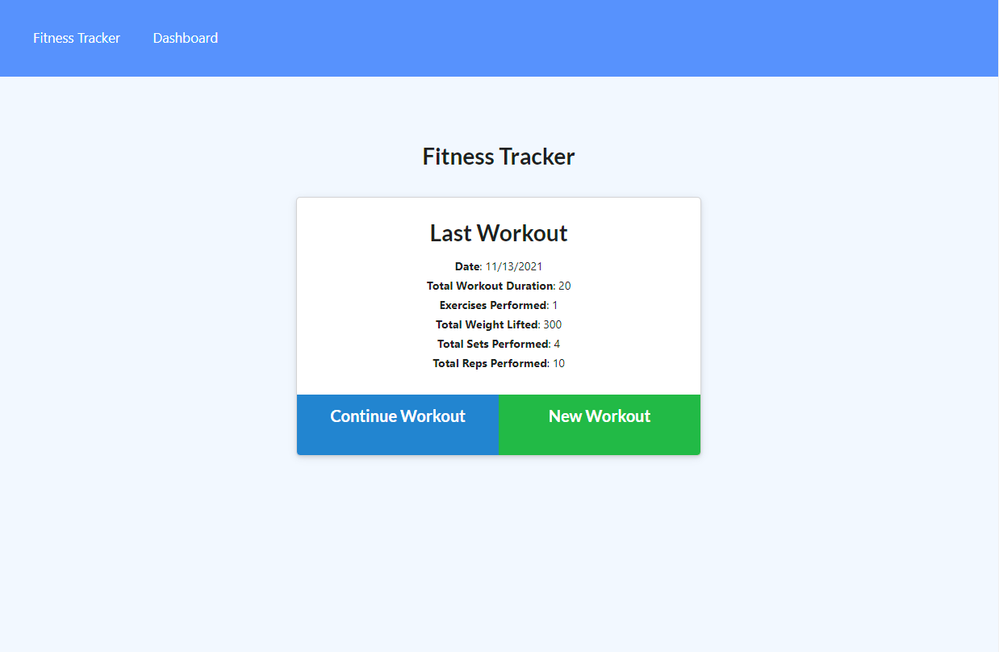
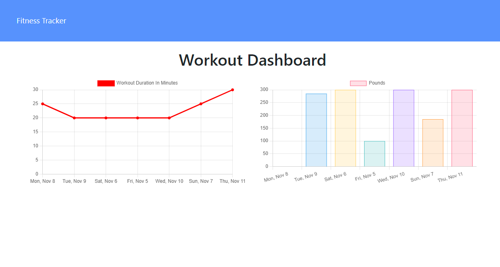

# workout-tracker

## Description

A web app lets the user create and track daily workouts, see aggregated workout data, and charts your last 7 workouts for easy review. This application uses MongoDB and the 'elegant mongodb object modeling for node.js' [Mongoose](https://mongoosejs.com/), to build out the app's workout model and enable a quick and easy connection to the database. Using MongoDB's aggregation through Mongoose's aggregate API, the user can see the total time put in for each exercise.

## Link

This app has been deployed to Heroku and the database is hosted on MongoDB Atlas.

[Link to the deployment.](https://guarded-tor-05063.herokuapp.com/)

## Screenshots

## Tech Stack

* Express
* MongoDB/Mongoose
* Node.js
